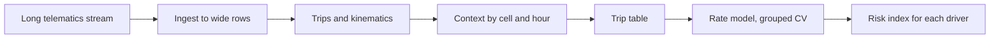
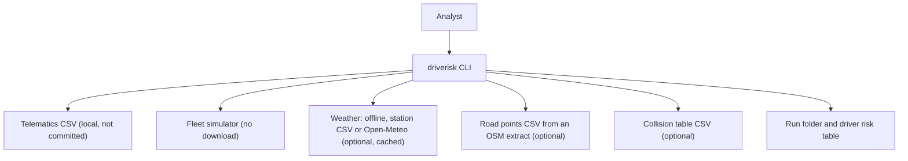
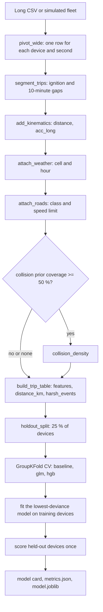

<div align="center">

# driverisk — Trip-Level Driving Risk from Telematics and Location-Matched Context

**driverisk is a driving-risk model kit for usage-based insurance research. It takes a long telematics stream through these steps to a risk index for each driver:**

`ingest` → `segment trips` → `attach weather and roads` → `count harsh events` → `fit a rate model` → `score drivers`.


**[Summary](#1-summary)** ·
**[Workflow](#4-the-end-to-end-workflow)** ·
**[Run it](#10-how-to-run-driverisk)** ·
**[Configuration](#104-environment-variables)** ·
**[Known problems](#13-known-problems)** ·
**[Glossary](#15-glossary)**

</div>

> [!NOTE]
> This README uses ASD-STE100 Simplified Technical English. The writing rules and the project
> vocabulary are in [`docs/ste-style-guide.md`](docs/ste-style-guide.md). Each term in the
> [Glossary](#15-glossary) has only one meaning.

> [!CAUTION]
> Do not use the driverisk risk index as a pricing, underwriting or claims decision. A person must review it.
> Telematics traces are personal location data. Get the consent of each driver, and keep the files private.

---

driverisk changes a raw telematics stream into one row for each trip, with exposure, features and a target.
The target is the count of harsh events, and the features never read the acceleration signals that define it.
Weather and road class come from the place and the hour of each reading, never from the hour alone.
Each validation keeps all trips of one device on one side, so the scores measure new drivers.

This README is the **one location that explains all of driverisk**. It gives these topics:

- the general design
- each component and its procedure, step by step
- the decision rules
- the data map
- the runbook
- the validation results and the known problems

| If you are… | Read |
|---|---|
| A manager or reviewer | [1](#1-summary), [3](#3-design-rules), [4](#4-the-end-to-end-workflow), [12](#12-validation-results), [14](#14-key-points) |
| A developer who joins the project | All sections, in sequence. Keep [10](#10-how-to-run-driverisk) and [13](#13-known-problems) open while you work |
| An operator who runs driverisk | [10](#10-how-to-run-driverisk), then the section for the component that you use |

---

## Table of contents

1. 🧭 [Summary](#1-summary)
2. 🏗️ [How driverisk is built](#2-how-driverisk-is-built)
   - 2.1 [Components](#21-components)
   - 2.2 [System context](#22-system-context)
   - 2.3 [Repository layout](#23-repository-layout)
3. 🛡️ [Design rules](#3-design-rules)
4. 🔄 [The end-to-end workflow](#4-the-end-to-end-workflow)
   - 4.1 [Full flow](#41-full-flow)
   - 4.2 [The life cycle of one trip](#42-the-life-cycle-of-one-trip)
5. 🔵 [The ingest and the trips](#5-the-ingest-and-the-trips)
6. 🟢 [The context providers](#6-the-context-providers)
7. 🟣 [The trip table and the rate models](#7-the-trip-table-and-the-rate-models)
8. ⚖️ [The event rules and the metrics](#8-the-event-rules-and-the-metrics)
9. 🗂️ [Data and file map](#9-data-and-file-map)
10. ▶️ [How to run driverisk](#10-how-to-run-driverisk)
    - 10.1 [Prerequisites](#101-prerequisites) · 10.2 [Installation](#102-installation) · 10.3 [Run driverisk](#103-run-driverisk) · 10.4 [Environment variables](#104-environment-variables)
11. 🧩 [How to extend driverisk](#11-how-to-extend-driverisk)
12. ✅ [Validation results](#12-validation-results)
13. ⚠️ [Known problems](#13-known-problems)
14. 📌 [Key points](#14-key-points)
15. 📖 [Glossary](#15-glossary)
16. 📄 [License](#16-license)

---

## 1. Summary

**The problem.** An insurer wants to know which drivers drive in a risky way, from the data of a telematics box. These questions are difficult:

- How do you read a long stream where one `value` column holds speed, RPM and position text?
- How do you add weather and road data for the real place of the vehicle?
- Which target is independent of the model inputs?
- How do you measure a model on drivers that it did not see?
- How do you compare drivers with different distances?

driverisk gives each of these questions its own component. Each component is a pure function, a provider class or a CLI command.

| Item | Value |
|---|---|
| Input | A long telematics CSV (`deviceId, timestamp, variable, value`), or a simulated fleet |
| Output | A trip table, a run folder (`model.joblib`, `metrics.json`, `model_card.md`) and a risk index for each driver |
| Components | **15** modules: config, ingest, trips, events, weather, roads, collisions, features, synthetic, pipeline, models, evaluate, experiment, report, cli |
| Models | `baseline` (fleet rate), `glm` (Poisson GLM), `hgb` (gradient boosting with Poisson loss) |
| Providers | Weather: offline, station CSV or Open-Meteo. Roads: offline or an OpenStreetMap point CSV. Collision prior: optional CSV |
| Offline mode | All commands. With no CSV, the commands simulate a fleet. No key and no network |
| Safety | No feature reads `acc_x`, `acc_y`, `acc_z` or `acc_long`. No device is on both sides of a split |
| Tests | **31** unit tests (`pytest`) |



---

## 2. How driverisk is built

### 2.1 Components

| Component | Module | Purpose |
|---|---|---|
| Settings | `src/driverisk/config.py` | Environment variables and a local `.env` loader |
| Ingest | `src/driverisk/ingest.py` | Variable names, `POSITION` parser, long to wide pivot, ingest report |
| Trips | `src/driverisk/trips.py` | Trip segmentation, distance, longitudinal acceleration |
| Events | `src/driverisk/events.py` | Harsh event rules and the event count of a trip |
| Weather | `src/driverisk/context/weather.py` | Offline, station CSV and Open-Meteo providers. Join by cell and hour |
| Roads | `src/driverisk/context/roads.py` | Offline road map and a nearest-point lookup in an OSM point CSV |
| Collision prior | `src/driverisk/context/collisions.py` | Collisions for each cell, with a coverage check |
| Features | `src/driverisk/features.py` | Trip table and the check that no feature reads a target signal |
| Synthetic fleet | `src/driverisk/synthetic.py` | Fake long-format readings for many drivers |
| Pipeline | `src/driverisk/pipeline.py` | Providers from settings. Stream to points to trip table |
| Models | `src/driverisk/models.py` | `RateModel`: baseline, Poisson GLM, Poisson gradient boosting |
| Evaluation | `src/driverisk/evaluate.py` | Poisson deviance, D², Gini, calibration, driver table |
| Experiment | `src/driverisk/experiment.py` | Held-out devices, grouped CV, training, importance, run folder |
| Model card | `src/driverisk/report.py` | `model_card.md` from the run summary |
| CLI | `src/driverisk/cli.py` | The `driverisk` command with 6 subcommands |

### 2.2 System context



### 2.3 Repository layout

```
driverisk/
├── .github/workflows/ci.yml        # CI: Python 3.11, pip install -e ".[dev]", pytest -q
├── .env.example                    # 12 environment variables, all values empty
├── pyproject.toml                  # package, dev extra, driverisk script
├── data/README.md                  # input formats, sources, licences
├── docs/ste-style-guide.md         # writing rules and project vocabulary
├── src/driverisk/
│   ├── config.py  ingest.py        # settings, long to wide pivot
│   ├── trips.py  events.py         # trips, kinematics, harsh events
│   ├── context/                    # weather.py, roads.py, collisions.py
│   ├── features.py  synthetic.py   # trip table, fleet simulator
│   ├── pipeline.py  models.py      # stream to trip table, rate models
│   ├── evaluate.py  experiment.py  # metrics, grouped CV, training
│   └── report.py  cli.py           # model card, command line
└── tests/                          # 31 tests, no network, no keys
```

---

## 3. Design rules

### 3.1 Each signal has its own column
`pivot_wide` maps each `variable` to one signal column. A speed value, an RPM value and a position text never share a column. Unknown variables are counted in the ingest report.

### 3.2 The target is independent of the features
The target counts harsh events in the acceleration signals. `assert_no_label_inputs` refuses a feature name that contains `acc_x`, `acc_y`, `acc_z`, `acc_long` or `harsh_`. A test doubles the acceleration and shows that the features stay the same.

### 3.3 Context matches place and hour
`attach_weather` joins on the weather cell and the UTC hour. A reading with no position gets no weather. A station CSV gives weather only within 50 km.

### 3.4 No per-row API calls
Road classes come from a local point file with a BallTree lookup. The Open-Meteo provider sends one request for each cell and day range, and it keeps a disk cache.

### 3.5 A device is on one side of each split
`holdout_split` keeps 25 % of the devices out. Grouped CV uses `GroupKFold` by device. Preprocessing is inside each model, so it fits on training trips only.

### 3.6 Rates use exposure
Each model learns events per km with the trip distance as the weight. The expected count of a trip is the rate times the distance.

### 3.7 Prototype problems and their fixes

| # | Problem in the earlier prototype | Fix in driverisk |
|---|---|---|
| 1 | The label was a threshold rule on two input columns | The target is harsh events from acceleration. No feature reads those signals |
| 2 | `value` mixed speed, RPM, pressure and position | `pivot_wide` gives each signal its own typed column |
| 3 | Weather from another country, joined on the hour only | Join by cell and hour. Station CSV within 50 km. Open-Meteo for the real place |
| 4 | The position parser failed, and geocoding called an API for each row | `parse_position` reads `lat,lon` and `lat,lon,alt`. Roads come from a local OSM point file |
| 5 | The casualty table was never joined | `CollisionPrior` uses a collision table with coordinates and refuses a casualty table. It checks the coverage |
| 6 | Scaling before the split and a random row split | Preprocessing inside the model. Held-out devices and grouped CV |
| 7 | Three devices over one week | A simulator for many drivers. The README states that real results need a larger fleet |
| 8 | MAE on binary labels and an undersampled test set | Poisson deviance, D², Gini and calibration on all held-out trips |
| 9 | Colab paths and thresholds edited by hand | One CLI, one settings module, fixed event rules in `EventRules` |

---

## 4. The end-to-end workflow

### 4.1 Full flow



### 4.2 The life cycle of one trip

1. The device sends readings, one row for each signal.
2. The ingest makes one typed row for each device and second.
3. The ignition change or a gap of more than 600 s starts the trip.
4. The kinematics step adds the distance and the longitudinal acceleration.
5. The providers add weather, road class and speed limit for each reading.
6. The trip table gives the trip its features, its distance and its harsh event count.
7. Trips shorter than 0.5 km or 2 minutes are dropped.
8. The model gives the trip a rate. The driver table adds the trips of each device.

---

## 5. The ingest and the trips

**Purpose.** Change the raw stream into typed readings and trips.

| Input | Output |
|---|---|
| Long CSV read as text | Wide readings with `trip_id`, `dt_s`, `dist_m`, `acc_long`, and an `IngestReport` |

**Procedure**

1. Refuse a table that has no `deviceId`, `timestamp`, `variable` or `value` column.
2. Normalise each variable name (upper case, letters only) and map it to a signal.
3. Parse the timestamps as UTC and floor them to the second. Count the bad timestamps.
4. Change the numeric signals to numbers. Count the bad numbers.
5. Parse `POSITION` as `lat,lon` or `lat,lon,alt`. A text outside the valid ranges, or `0,0`, is a bad position.
6. Pivot to one row for each device and second. If `DRIVERISK_ACC_UNIT=g`, multiply the accelerations by 9.80665.
7. Keep a position for 5 seconds and the ignition state until the next change.
8. Start a new trip at an ignition change from 0 to 1, or after a gap of more than 600 s. Drop the rows with the ignition off.
9. Use `acc_x` as `acc_long`. If `acc_x` is missing, use the speed change, only where two readings are at most 3 s apart.
10. Use the GPS distance. If a position is missing, use the mean speed times the time step.

---

## 6. The context providers

**Purpose.** Add weather, road class and collision density for the place and the hour of each reading.

| Provider | Class | Input | Rule |
|---|---|---|---|
| Offline weather | `OfflineWeather` | Seed | Deterministic for each (seed, 0.1° cell, day). Demo and tests only |
| Station weather | `CsvWeather` | `station_id, lat, lon, time, temp_c, precip_mm, wind_ms` | Nearest station within 50 km. Else no weather |
| Open-Meteo | `OpenMeteoWeather` | Network, no key | One request for each cell and day range. JSON cache on disk. `User-Agent` from settings |
| Offline roads | `OfflineRoads` | Seed | One class for each 0.02° cell |
| OSM road points | `RoadSegmentsCsv` | `lat, lon, road_class, speed_limit_kmh` | Nearest point within 50 m. Else `unknown` |
| Collision prior | `CollisionPrior` | A table with `latitude`, `longitude` | Count for each 0.01° cell. Used when 50 % or more of the readings are inside its area |

| Road class | Offline speed limit (km/h) |
|---|---|
| `motorway` | 110 |
| `primary` | 80 |
| `secondary` | 60 |
| `residential` | 40 |

**Rules**

- The weather join key is (cell, hour). The code never joins on the hour alone.
- A casualty table has no location. `CollisionPrior.from_csv` refuses it with a clear message.
- The context report gives the share of readings with a position, weather and a known road class.
- If a provider is offline, the context report says that the context is synthetic.

---

## 7. The trip table and the rate models

**Purpose.** Make one row for each trip, and learn the harsh event rate.

| Feature group | Columns |
|---|---|
| Time and size | `duration_min`, `start_hour`, `weekend`, `night_share` (22:00 to 05:59 UTC) |
| Speed | `mean_speed_kmh`, `p50_speed_kmh`, `p95_speed_kmh`, `max_speed_kmh`, `speed_std_kmh`, `idle_share` |
| Weather | `rain_share` (0.1 mm/h or more), `mean_precip_mm`, `mean_wind_ms`, `mean_temp_c` |
| Road | `share_motorway`, `share_primary`, `share_secondary`, `share_residential`, `share_unknown`, `speeding_share` |
| Engine and prior | `p95_rpm`, `collision_density` |
| Exposure | `distance_km` (not a feature) |
| Target | `harsh_events` = `harsh_brake` + `harsh_accel` + `harsh_corner` (not features) |

| Model | What it learns |
|---|---|
| `baseline` | One fleet rate: total events / total km |
| `glm` | Median imputation with missing flags, scaling, `PoissonRegressor(alpha=1.0)` |
| `hgb` | `HistGradientBoostingRegressor(loss="poisson")`, learning rate 0.05, 300 iterations, 15 leaves, 20 trips for each leaf |

**Procedure (train)**

1. Keep 25 % of the devices out with `GroupShuffleSplit`.
2. Run `GroupKFold` CV (5 folds) on the other devices for each model.
3. Keep the model with the lowest mean CV Poisson deviance.
4. Fit it on all training devices with the distance as the weight.
5. Score the held-out devices one time. Make the driver table and the permutation importance.

**Rules**

- `speeding_share` is the share of readings with speed above the limit plus 10 km/h.
- `train` needs 4 devices or more. Grouped CV needs 2 devices or more.
- `score` uses all trips in the input, so it includes the training devices of the run.

---

## 8. The event rules and the metrics

| Event | Rule (`EventRules`) |
|---|---|
| `harsh_brake` | `acc_long <= -3.0` m/s² |
| `harsh_accel` | `acc_long >= 2.5` m/s² |
| `harsh_corner` | `abs(acc_y) >= 3.0` m/s² |
| One event | Flagged readings less than 3 s apart are one event |

| Trip rule (`TripRules`) | Value |
|---|---|
| Minimum distance | 0.5 km |
| Minimum duration | 2 minutes |
| Speeding margin | 10 km/h |
| Rain | 0.1 mm/h or more |

| Metric | Meaning |
|---|---|
| Poisson deviance | Mean Poisson deviance of the expected count of each trip |
| D² vs fleet rate | 1 − model deviance / deviance of the fleet rate |
| Normalised Gini | Gini of the Lorenz curve (km against events, sorted by predicted rate) divided by the best possible Gini |
| Expected / observed | Sum of expected events divided by the sum of observed events |
| Calibration | Observed and expected events in 10 bins of the expected count |
| Driver Spearman | Rank correlation of predicted and observed rates of the held-out drivers |
| Importance | Increase of the Poisson deviance when one feature is shuffled (5 repeats) |

| Decision | Rule |
|---|---|
| Model choice | Lowest mean grouped-CV Poisson deviance. A tie goes to the first name in alphabetical order |
| Risk index | 100 × driver predicted rate / fleet predicted rate. 100 is the fleet mean |

---

## 9. Data and file map

| Path | Committed? | Contents |
|---|---|---|
| `data/README.md` | Yes | Input formats, sources and licences |
| `data/*.csv` | No (git ignores it) | Telematics, trip tables, weather, road points, collisions |
| `runs/<name>/model.joblib` | No (git ignores it) | Fitted model, feature list, summary |
| `runs/<name>/metrics.json` | No (git ignores it) | Full run summary |
| `runs/<name>/model_card.md` | No (git ignores it) | Model card |
| `.cache/driverisk/` | No (git ignores it) | Open-Meteo responses |
| `.env.example` | Yes | All 12 environment variables, empty |
| `.env` | No (git ignores it) | Local settings |

---

## 10. How to run driverisk

### 10.1 Prerequisites

| Need | For |
|---|---|
| Python 3.11+ | All components |
| numpy, pandas, scikit-learn, joblib, threadpoolctl | Core (installed with the package) |
| Network access | Only `DRIVERISK_WEATHER=open-meteo` |
| An OSM road point CSV | Real road classes (optional) |

### 10.2 Installation

```bash
git clone https://github.com/KrishnaAnnavaram/driverisk.git
cd driverisk
python -m venv .venv
. .venv/bin/activate            # Windows: .venv\Scripts\activate
pip install -e ".[dev]"
```

### 10.3 Run driverisk

Offline (simulated fleet, no network):

```bash
driverisk train                                       # 40 drivers x 12 trips -> runs/latest
driverisk score --run runs/latest --out drivers.csv   # risk index for each driver
driverisk explain --run runs/latest                   # permutation importance
driverisk simulate --drivers 40 --trips 12 --out data/synthetic_telematics.csv
driverisk validate data/synthetic_telematics.csv      # ingest report
driverisk trips --data data/synthetic_telematics.csv --out data/trips.csv
driverisk train --trip-table data/trips.csv --models glm,hgb --out runs/glm_hgb
```

With real data and real context:

```bash
# .env
DRIVERISK_DATA=data/fleet_export.csv
DRIVERISK_WEATHER=open-meteo
DRIVERISK_ROADS=csv
DRIVERISK_ROADS_CSV=data/osm_road_points.csv
DRIVERISK_ACC_UNIT=g

driverisk validate data/fleet_export.csv
driverisk train --out runs/fleet
```

`python -m driverisk` is the same as `driverisk`. An error prints `error: <message>`, and the exit code is 1.

### 10.4 Environment variables

| Variable | Used by | Meaning |
|---|---|---|
| `DRIVERISK_DATA` | Data commands | Long telematics CSV. Empty: simulated fleet |
| `DRIVERISK_SEED` | Data commands | Seed for the simulator, offline providers and splits. Default 42 |
| `DRIVERISK_OUTPUT` | `train` | Parent folder of `latest`. Default `runs` |
| `DRIVERISK_WEATHER` | Weather | `offline` (default), `csv` or `open-meteo` |
| `DRIVERISK_WEATHER_CSV` | Weather | Station CSV. Necessary for `csv` |
| `DRIVERISK_ROADS` | Roads | `offline` (default) or `csv` |
| `DRIVERISK_ROADS_CSV` | Roads | Road point CSV. Necessary for `csv` |
| `DRIVERISK_COLLISIONS_CSV` | Collision prior | Collision table with coordinates. Empty: no prior |
| `DRIVERISK_CACHE_DIR` | Open-Meteo | Cache folder. Default `.cache/driverisk` |
| `DRIVERISK_USER_AGENT` | Open-Meteo | HTTP `User-Agent`. Default `driverisk/0.1 (research use)` |
| `DRIVERISK_ACC_UNIT` | Ingest | `ms2` (default) or `g` |
| `DRIVERISK_THREADS` | All commands | Maximum native threads. Default 4 |

The CLI reads `--env-file` (default `.env`) first. A variable that is already set is not replaced.
The project needs no credentials. Open-Meteo needs no key.

---

## 11. How to extend driverisk

| You want to… | Do this | Code change? |
|---|---|---|
| Use real weather | Set `DRIVERISK_WEATHER=open-meteo` or a station CSV | No |
| Use real roads | Prepare an OSM point CSV and set `DRIVERISK_ROADS=csv` | No |
| Add a signal name | Add it to `SIGNALS` in `ingest.py` | Small |
| Change the event limits | Pass other values to `EventRules` | Small |
| Add a weather provider | Write a class with `name` and `hourly(lat, lon, start, end)` | Small |
| Use claims as the target | Add a claim count column to the trip table and set `TARGET` | Yes |

Planned milestones (not built): map matching of the GPS track, claims as a second target, and a larger public multi-driver data set.

---

## 12. Validation results

| Validation | Result | Command |
|---|---|---|
| Unit tests (CI installs only `.[dev]`) | **31 passed** (pandas 3.0, scikit-learn 1.9) | `pytest -q` |
| Synthetic ingest | 1,402,560 readings, 40 devices, 0 bad values, 480 trips | `driverisk train` |
| Synthetic grouped CV (30 training devices, 5 folds) | Poisson deviance: baseline 1.796, glm 1.617, hgb 1.651. D²: glm 0.094, hgb 0.015 | `driverisk train` |
| Synthetic held-out devices (10 devices, 120 trips, glm) | D² 0.076, normalised Gini 0.522, expected / observed 0.997, driver Spearman 0.879 | `driverisk train` |
| Top feature | `speeding_share` (deviance increase 0.156) | `driverisk train` |

All synthetic numbers use the default fleet (40 drivers, 12 trips, seed 42) and the offline providers.
In the simulator, a hidden driver style controls speed, speeding and harsh events. The results show that the pipeline finds that style through the speed features. They tell you nothing about real drivers.
The earlier prototype reported high classifier scores on a rule label (prototype result, not reproduced here). Those scores measured the rule, not driving risk.

---

## 13. Known problems

Read these problems before you use driverisk in production.

| # | Area | Problem | Impact and action |
|---|---|---|---|
| 1 | Data | No real multi-driver fleet is in the repository or in CI | Measure the models on your own consented fleet before you use a score |
| 2 | Target | Harsh events are a proxy. They are not claims or crashes | Add claims as a target when you have them |
| 3 | Roads | The road lookup uses the nearest point, not map matching | On parallel roads the class can be wrong. Map matching is a planned milestone |
| 4 | Time zone | `night_share` and `start_hour` use UTC | Change the times to local time before you compare regions |
| 5 | Devices | One device is one driver | A shared car mixes drivers. Add a driver ID if you have one |
| 6 | Events | Fixed limits for all vehicles and sample rates | A truck or a 10 Hz device needs other limits in `EventRules` |
| 7 | Open-Meteo | Network and terms of use | Keep the cache. Read the provider terms before bulk use |
| 8 | Score | `score` includes the training devices of the run | Use the held-out metrics in the model card for an unbiased view |

**Responsible use.** The risk index is not a pricing, underwriting or claims decision. A person must review it. Telematics traces are personal location data: get consent, keep the files private and never commit them. Driving style differs by region, road network and vehicle, so a model from one fleet can be biased for another.

---

## 14. Key points

1. **Each signal has its own column.** The long `value` column is never one feature.
2. **The target is independent of the features.** Harsh events come from acceleration, and no feature reads acceleration.
3. **Context matches place and hour.** Weather and roads come from the cell of the reading.
4. **No device is on both sides of a split.** Held-out devices and grouped CV measure new drivers.
5. **Rates use exposure.** A long trip and a short trip are compared per km.
6. **The full demo runs offline.** All 31 tests run without a download, a key or a network.

---

## 15. Glossary

| Term | Meaning |
|---|---|
| **Cell** | A square of the map: 0.1° for weather, 0.02° for offline roads, 0.01° for collisions |
| **Collision prior** | Collisions for each cell from a collision table |
| **Context** | Weather, road class and collision density for a reading |
| **D²** | Share of the fleet-rate deviance that a model removes |
| **Device** | One vehicle unit. One device is one driver |
| **Exposure** | The trip distance in km |
| **Fleet rate** | Total events divided by total km of the training trips |
| **Harsh event** | One run of readings over a braking, acceleration or lateral limit |
| **Held-out devices** | The 25 % of devices that `train` keeps out until the final score |
| **Normalised Gini** | Ranking quality of the predicted rates. 1 is the best possible ranking |
| **Poisson deviance** | The loss of a count model. Lower is better |
| **Provider** | A class that gives weather or road class |
| **Rate** | Harsh events per km |
| **Reading** | One row of the long telematics stream |
| **Risk index** | 100 × the predicted rate of a driver divided by the fleet mean |
| **Signal** | One measured quantity after the ingest |
| **Trip** | Readings of one device between an ignition start and a stop or a long gap |
| **Trip table** | One row for each trip: features, exposure and target |

---

## 16. License

[MIT](LICENSE) © 2026 Krishna Annavaram
